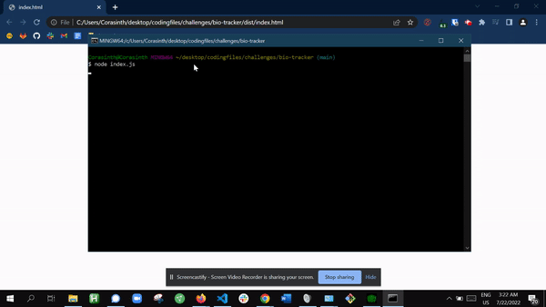

# Bio-Generator

## Description 

This command line app makes use of inquirer to allow a user to input information for several different employees and get a clean HTML page back with those employee's information displayed. 

## Table of Contents

* [Installation](#installation)
* [Credits](#credits)
* [License](#license)
* [Features](#features)
* [Tests](#tests)

## Installation

To install, simply clone the repository and run an npm install.

## Usage 

You can run this app by opening the index.js file with node.js or a similar program and following the inquirer prompts. 

Below is a gif of the functionality.

## Credits

This app makes use of both Inquirer and Jest (for testing).

## [License](./LICENSE)
This website uses the open-source MIT License.

## Tests

This feature has a suit of tests for the different kinds of employee. Each employee type (manager, engineer, and intern) are a subclass of the object Employee. The tests ensure that these classes and the parent class are accepting information as intended. 

---